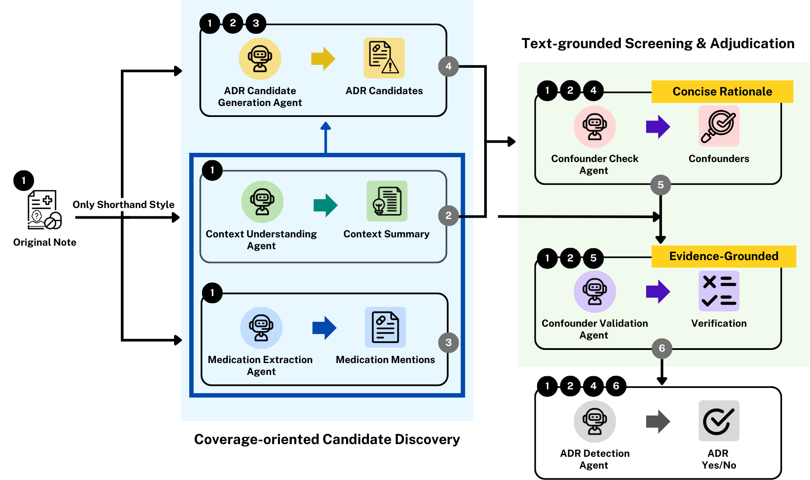
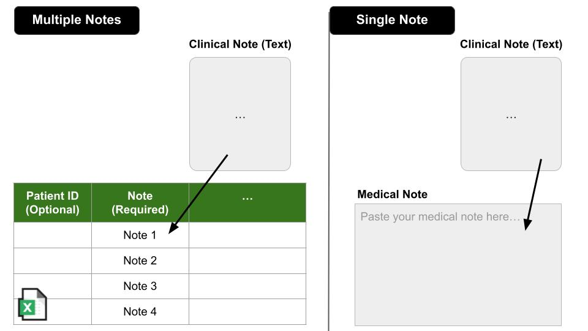

# Multi-Agent Framework for Adverse Drug Reaction (ADR) Detection in Clinical Notes

A collaborative multi-agent LLM framework that detects adverse drug reactions from clinical notes through a three-step pipeline: **Discovery → Screening → Validation**.

<p align="center">
  
</p>

## Overview

Clinical notes contain critical ADR information in diverse formats — from structured shorthand (`MTF → GI trouble`) to full narrative sentences. This framework uses six specialized LLM agents organized in two phases to achieve high-precision ADR extraction:

| Phase | Agent | Role |
|-------|-------|------|
| **A — Discovery** | Context Agent | Converts shorthand notes into readable narrative (shorthand style only) |
| | Medications Agent | Extracts all drug mentions (generic, brand, abbreviations, drug classes) |
| | ADR Candidates Agent | Identifies all plausible drug–symptom pairs |
| **B — Screening** | Confounders Check Agent | Flags candidates with alternative clinical explanations |
| | Confounders Validation Agent | Verifies confounder claims against original note evidence spans |
| | ADR Final Agent | Synthesizes all evidence into final ADR determinations |

The framework supports two clinical note styles:
- **Shorthand**: Abbreviated/symbolic notes (e.g., EMR shorthand with arrows, slashes, indentation)
- **Narrative**: Full-sentence clinical notes (e.g., MIMIC discharge summaries)

## Project Structure

```
multi-agent-ADR-detection/
├── agents.py           # Six LLM agent definitions with style-aware prompts
├── pipeline.py         # Three-step pipeline runner (CLI)
├── utils.py            # Binary label conversion utility
├── requirements.txt    # Python dependencies
├── .env.example        # API key template (copy to .env)
├── dashboard/
│   ├── app.py          # Streamlit interactive dashboard
│   ├── .env.example    # API key template for dashboard
│   ├── requirements.txt
│   ├── note_sample.xlsx            # Sample input file
│   ├── Multi-Agent_Framework.png   # Framework diagram
│   └── note_example.jpg            # Input format example
└── README.md
```

## Setup

### Prerequisites

- Python 3.10 or higher
- An OpenRouter API key ([OpenRouter](https://openrouter.ai/keys))

### 1. Clone the repository

```bash
git clone https://github.com/sungmoonie/multi-agent-ADR-detection.git
cd multi-agent-ADR-detection
```

### 2. Create a virtual environment (recommended)

```bash
python -m venv venv
source venv/bin/activate        # macOS / Linux
# venv\Scripts\activate         # Windows
```

### 3. Install dependencies

```bash
pip install -r requirements.txt
```

This installs all required packages including `pandas`, `streamlit`, and others. LLM 호출은 [OpenRouter](https://openrouter.ai/) API를 통해 이루어지며, 기본 모델은 Gemini 3 Flash입니다. 다른 모델을 사용하고 싶을 경우 [OpenRouter Models](https://openrouter.ai/models)에서 모델명을 확인한 뒤 `--model` 옵션으로 지정하면 됩니다.

### 4. Set up your API key

Copy the example file and fill in your key:

```bash
cp .env.example .env
```

Edit `.env`:

```
OPENROUTER_API_KEY=your_openrouter_api_key_here
```

For the dashboard, also set up its `.env`:

```bash
cp dashboard/.env.example dashboard/.env
```

Edit `dashboard/.env` with the same API key.

## Usage

### Option A: Command-Line Pipeline

Run the pipeline directly on an Excel file:

```bash
# Shorthand style (default)
python pipeline.py data.xlsx --style shorthand --note-col note_preprocessed

# Narrative style
python pipeline.py data.xlsx --style narrative --note-col text

# With a different model (via OpenRouter)
python pipeline.py data.xlsx --style narrative --note-col text --model anthropic/claude-sonnet-4
```

**Quick test with sample data:**

```bash
python pipeline.py note_sample.xlsx --style shorthand --note-col note_preprocessed
```

**Arguments:**

| Argument | Default | Description |
|----------|---------|-------------|
| `filename` | *(required)* | Input Excel file (.xlsx) |
| `--style` | `shorthand` | `shorthand` or `narrative` |
| `--note-col` | auto | Column containing note text (`note_preprocessed` for shorthand, `text` for narrative) |
| `--model` | `google/gemini-3-flash-preview` | OpenRouter model name |

**Output:** `<input_name>_results.xlsx` — a single file containing all intermediate and final columns.

### Option B: Interactive Dashboard

Launch the Streamlit dashboard for a visual, interactive experience:

```bash
cd dashboard
streamlit run app.py
```

The dashboard provides:
- **File Upload**: Upload CSV/XLSX files with multiple notes
- **Single Note**: Paste a single clinical note for instant analysis
- **Note Style Selection**: Choose between shorthand and narrative
- **Overview**: ADR distribution charts and top drug–symptom pairs
- **Note Browser**: Drill into individual notes with full reasoning trace
- **Drug & ADR Analysis**: Explore ADR profiles per drug across all notes

<p align="center">
  
  <br><em>Example input format</em>
</p>

## Input Format

Your input Excel file needs at minimum **one column containing clinical note text**. You specify which column to use via `--note-col` (CLI) or the column selector (dashboard).

| Column | Required | Description |
|--------|----------|-------------|
| Note text column | Yes | Raw clinical note text (name is configurable) |
| ID column | No | Note identifier (auto-generated if absent) |

## Output Columns

The pipeline adds the following columns to the output file:

| Column | Step | Description |
|--------|------|-------------|
| `context_note` | 1 | Narrative reconstruction (shorthand style only) |
| `medications` | 1 | Extracted medications (JSON) |
| `ADR_candidates` | 1 | Drug–symptom candidate pairs (JSON) |
| `adr_candidates_side_effect` | 1 | De-novo ADR detection result |
| `adr_candidates_side_effect_binary` | 1 | Binary label (0/1) |
| `confounders` | 2 | Confounder evaluation for each candidate (JSON) |
| `confounder_side_effect` | 2 | ADR detection with confounder info |
| `confounder_side_effect_binary` | 2 | Binary label (0/1) |
| `confounder_validation` | 3 | Evidence-based validation of confounders (JSON) |
| `validation_side_effect` | 3 | **Final ADR detection** (JSON) |
| `validation_side_effect_binary` | 3 | **Final binary label** (0/1) |

## License

This project is released for academic and research purposes.

## Citation

If you use this framework in your research, please cite our paper:

```bibtex
@article{
  title={...},
  author={...},
  journal={...},
  year={2025}
}
```
